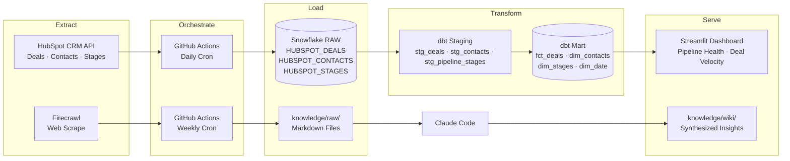
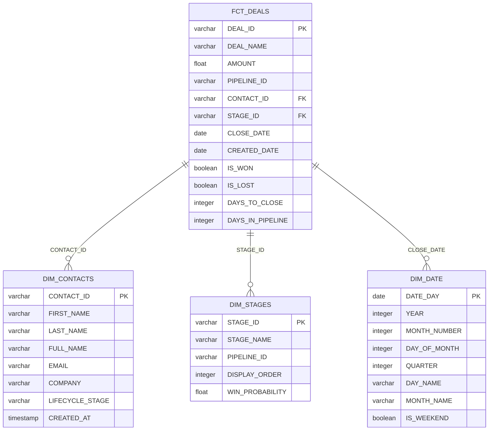
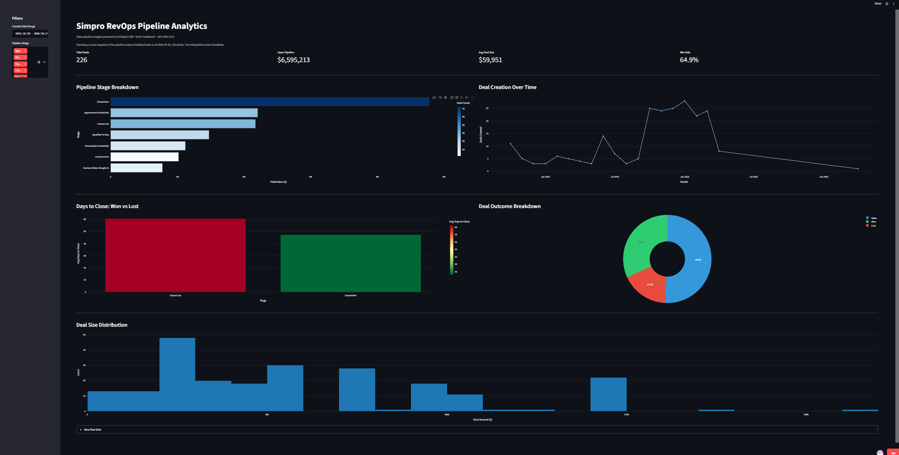

# Simpro RevOps Pipeline Analytics

This project builds an end-to-end analytics engineering pipeline targeting the Revenue Operations Analyst role at Simpro Group, a SaaS field service management company serving 22,000+ businesses worldwide. It extracts CRM deal and contact data from HubSpot via API and scrapes competitive intelligence from Simpro's website and review platforms using Firecrawl, then transforms both sources through a dbt star schema in Snowflake and surfaces pipeline health, deal velocity, and conversion insights in a deployed Streamlit dashboard. The result is a self-service analytics layer that answers three core questions a RevOps analyst at Simpro would face daily: where deals stall, what share of closed deals convert into wins, and how long won and lost deals take to close.

## Job Posting

- **Role:** Revenue Operations Analyst
- **Company:** Simpro Group
- **Link:** [Job Posting (PDF)](docs/job-posting.pdf)

This project demonstrates the exact skills the role requires: building and maintaining operational dashboards in Streamlit, owning data reliability through dbt tests and GitHub Actions automation, partnering with data engineering via a structured ELT pipeline, and communicating revenue trends to stakeholders through descriptive and diagnostic analytics.

## Tech Stack

| Layer | Tool |
|---|---|
| Source 1 | HubSpot CRM API (deals, contacts, pipeline stages) |
| Source 2 | Firecrawl web scrape (Simpro site, G2, Capterra, competitors) |
| Data Warehouse | Snowflake |
| Transformation | dbt |
| Orchestration | GitHub Actions |
| Dashboard | Streamlit |
| Knowledge Base | Claude Code (scrape → summarize → query) |

## Pipeline Diagram

## ERD (Star Schema)

## Dashboard Preview

## Key Insights

**Descriptive (what happened?):** Of 226 deals, 115 are still open, and most of those sit in the first two stages: 36 in Appointment Scheduled and 28 in Qualified To Buy. Only 12 have reached Contract Sent. 111 deals have closed: 72 won and 39 lost, so 65% of closed deals convert into wins. Won deals were also larger on average than lost deals ($66,405 vs $55,704).

**Diagnostic (why did it happen?):** Deals that close faster win more often. Deals closed within 30 days won 74% of the time and deals closed in 31 to 60 days won 70%, but deals that ran past 60 days won only 55%.

**Recommendation:** Flag any open deal that passes 45 days for a manager review, so the team can push it forward or close it out before it reaches the 60 day point where win rates drop.

*Note: these numbers come from HubSpot sample data built for a course project, so the patterns show how the analysis works, not Simpro's real results.*

## Live Dashboard

**Live app:** https://simpro-data-analysis-4ap8pslmvze2gzdbkumuau.streamlit.app/

The pipeline loads HubSpot data into Snowflake. Since the Snowflake trial ended, the live
demo runs on a saved snapshot of the same dbt output (`pipeline/build_snapshot.py`).

### Automation status

The daily **Extract and Load HubSpot Data** workflow (`.github/workflows/extract_load.yml`)
is **turned off** as of September 30, 2026. It loads HubSpot data into Snowflake, and it
failed every day after the Snowflake trial account expired. The workflow file is unchanged,
and the weekly **Scrape Knowledge Base Sources** workflow still runs.

To turn it back on (after adding working Snowflake credentials as repository secrets):

- On GitHub: **Actions** tab → **Extract and Load HubSpot Data** → **Enable workflow**
- Or from a terminal: `gh workflow enable "Extract and Load HubSpot Data" -R vsofelka/simpro-revenue-analysis`

To refresh the live demo's data without Snowflake, run `python pipeline/build_snapshot.py`
(needs `HUBSPOT_ACCESS_TOKEN` in `.env`) and commit the updated files in `streamlit/data/`.

## Knowledge Base

A Claude Code-curated wiki built from 22 scraped sources. Wiki pages live in `knowledge/wiki/`, raw sources in `knowledge/raw/`. Browse [`knowledge/wiki/index.md`](knowledge/wiki/index.md) to see all pages.

**Query it:** Open Claude Code in this repo and ask questions like:

- "What are the main pain points Simpro customers report on G2?"
- "Who are Simpro's main competitors and how do they differ?"
- "What RevOps metrics matter most to SaaS field service companies?"

Claude Code reads the wiki pages first and falls back to raw sources when needed. See `CLAUDE.md` for the query conventions.

## Setup & Reproduction

**Just the dashboard (no accounts needed):** the app falls back to the saved snapshot in
`streamlit/data/` when Snowflake isn't configured.

    pip install -r requirements.txt
    streamlit run streamlit/app.py

**Full pipeline prerequisites:** Python 3.11+, Snowflake account, HubSpot free CRM account with Private App access token, Firecrawl API key.

Copy `.env.example` to `.env` and fill in your credentials:

    HUBSPOT_ACCESS_TOKEN=
    SNOWFLAKE_ACCOUNT=
    SNOWFLAKE_USER=
    SNOWFLAKE_PASSWORD=
    SNOWFLAKE_DATABASE=
    SNOWFLAKE_WAREHOUSE=
    SNOWFLAKE_ROLE=
    FIRECRAWL_API_KEY=

**Run the full pipeline:**

    pip install -r requirements.txt
    python pipeline/hubspot_extract.py
    cd dbt && dbt run && dbt test && cd ..
    streamlit run streamlit/app.py
    python pipeline/firecrawl_scrape.py

**Refresh the snapshot** (HubSpot token only, no Snowflake): `python pipeline/build_snapshot.py`

**Run the tests:** `python -m pytest`

## Repository Structure

    .
    ├── .devcontainer/        # Dev container config
    ├── .github/workflows/    # GitHub Actions pipelines (HubSpot daily, Firecrawl weekly)
    ├── pipeline/             # hubspot_extract.py, firecrawl_scrape.py, build_snapshot.py
    ├── dbt/                  # dbt project (staging + mart models, tests, macros)
    │   └── profiles/         # DuckDB profile used to build the snapshot (no credentials)
    ├── streamlit/            # Streamlit dashboard (app.py)
    │   └── data/             # Saved snapshot the live demo runs on
    ├── tests/                # pytest: dashboard, data source, extract, snapshot
    ├── knowledge/            # Knowledge base
    │   ├── raw/              # 22 scraped source documents
    │   └── wiki/             # Claude Code-generated wiki pages
    ├── docs/                 # Proposal, job posting, slides, dashboard images
    ├── .env.example          # Required environment variables
    ├── .gitignore
    ├── CLAUDE.md             # Project context for Claude Code
    └── README.md             # This file
